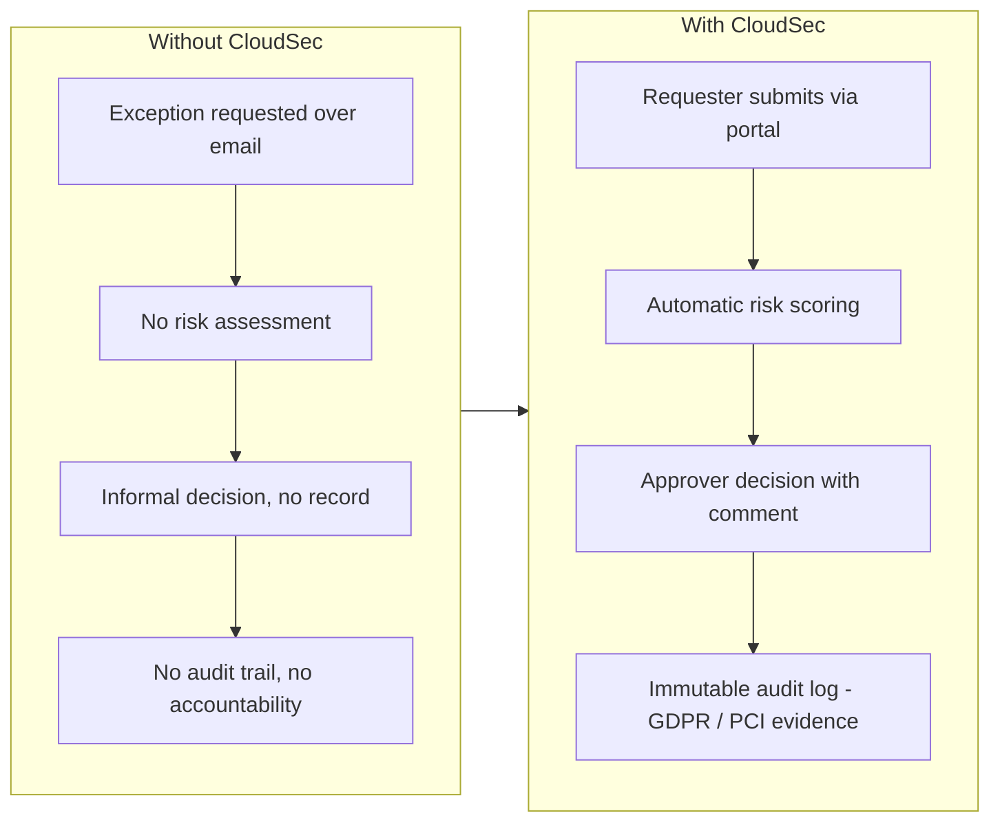
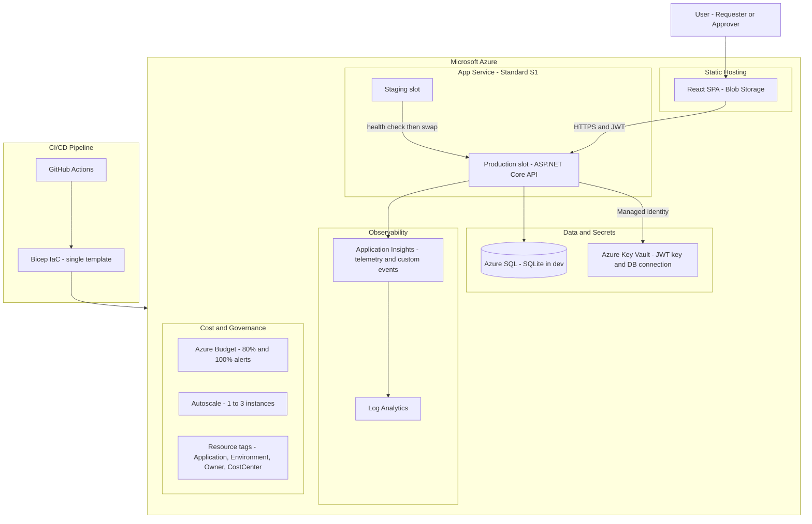
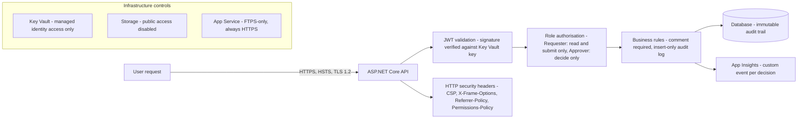
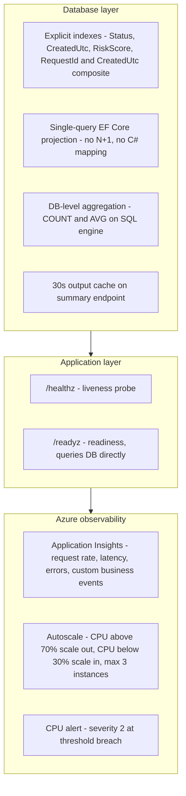

# CloudSec — Demo Diagrams

Diagrams for use during the recorded demo. Show each one at the point indicated in the script. Keep them on screen long enough to talk through the key points — roughly 30–60 seconds each.

---

## 1. Business problem — before vs after

> 📺 Use in: **Segment 1** (0:00–2:00) — show while setting context

---

## 2. System architecture

> 📺 Use in: **Segment 2** (2:00–6:00) — hold for ~60 seconds, then switch to Azure Portal

---

## 3. Security control flow

> 📺 Use in: **Segment 3** (6:00–10:00) — show briefly while introducing STRIDE

---

## 4. Performance and monitoring

> 📺 Use in: **Segment 5** (14:00–16:30) — show while discussing autoscale

---

## 5. Cost governance

> 📺 Use in: **Segment 6** (16:30–18:30) — show while discussing tags

```mermaid
flowchart LR
    subgraph RESOURCES [Deployed resources]
        R1["App Service - Standard S1 - min autoscale tier"]
        R2["Azure SQL - Basic 5 DTU"]
        R3["Blob Storage - LRS"]
        R4["Key Vault"]
        R5["App Insights and Log Analytics"]
    end

    subgraph TAGS [Resource tags on all resources]
        T1["Application: cloudsec"]
        T2["Environment: dev"]
        T3["Owner: engineering"]
        T4["CostCenter: cloud-module"]
    end

    subgraph CONTROLS [Cost controls]
        AUTO["Autoscale - 1 instance at idle, scales on real load"]
        BUDGET["Azure Budget - 30 USD/month cap, 80% and 100% alerts"]
        FUTURE["Reserved Instances - 72% discount via Azure billing commitment, not Bicep deployable"]
    end

    RESOURCES --> TAGS --> CONTROLS
```

---

## Segment placement guide

| Diagram | Segment | Timestamp | Purpose |
|---|---|---|---|
| Business problem | 1 | 0:00–2:00 | Frame the governance problem |
| System architecture | 2 | 2:00–6:00 | Walk through deployed components |
| Security control flow | 3 | 6:00–10:00 | Introduce STRIDE mitigations |
| Performance & monitoring | 5 | 14:00–16:30 | Show autoscale and observability |
| Cost governance | 6 | 16:30–18:30 | Show tagging and budget controls |
