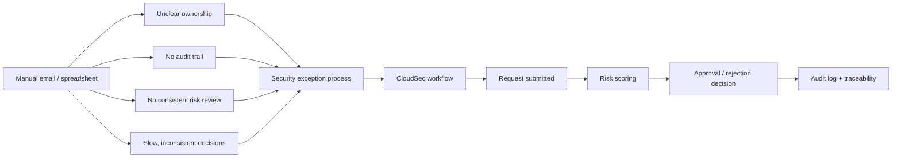
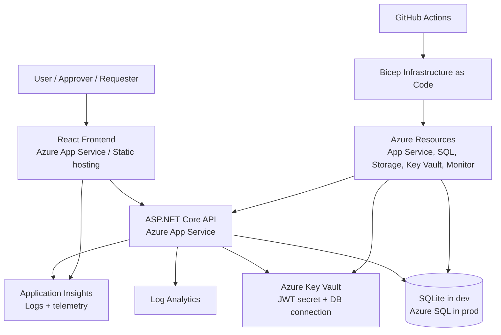
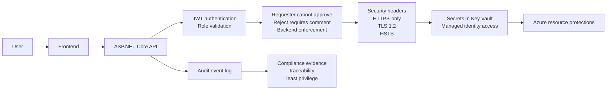
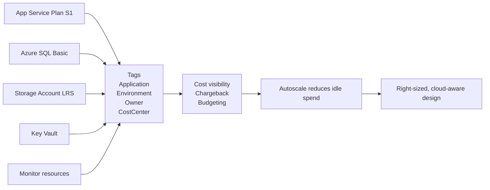

# CloudSec presentation diagrams

This file contains draft diagrams for the assessment presentation. These are designed to be simple, credible, and easy to explain in a live demo or recorded presentation.

---

## 1) Business problem / before vs after workflow

Use on: Slide 2 (Business problem)



Why this works:
- It shows the current pain clearly
- It frames the app as a governance improvement, not just an app feature
- Good for a business audience and for rubric alignment

---

## 2) System architecture diagram

Use on: Slide 4 (Architecture)



Suggested speaker notes:
- React app calls secured API
- API stores and reads data from database
- Key Vault provides managed secret access
- Bicep makes the environment reproducible and auditable
- App Insights / Log Analytics provide operational evidence

---

## 3) Security control diagram

Use on: Slide 5 (Security and compliance)



Suggested speaker notes:
- Security is enforced in the API, not just in the UI
- This is important because it demonstrates real governance controls
- Useful frame for GDPR / internal control narratives

---

## 4) Monitoring and health diagram

Use on: Slide 7 (Performance and monitoring)

```mermaid
flowchart TB
    LB[Azure App Service / Health Probe] --> HZ[/healthz]
    LB --> RD[/readyz]
    HZ --> API[API service]
    RD --> API

    API --> AI[Application Insights]
    AI --> METRICS[Request rate\nLatency\nFailures]

    API --> SCALE[Autoscale rules]
    SCALE --> CPU[CPU > 70% for 5 min\nScale out]
    CPU --> APP[More instances]
    SCALE --> LOW[CPU < 30% for 10 min\nScale in]

    API --> ALERT[CPU alert severity 2]
```

Suggested speaker notes:
- Health endpoints make the app operationally monitorable
- App Service uses the health endpoint to reduce downtime risk
- Autoscaling and alerting are real cloud controls, not just conceptual

---

## 5) Cost governance / resource ownership diagram

Use on: Slide 8 (Cost management)



Suggested speaker notes:
- Budget controls start with tagging and visibility
- Right-sized resources are cheaper and easier to justify
- Autoscale prevents paying for more capacity than needed

---

## 6) Simple presentation placement guide

Use these in the final deck:

- Slide 2: Business problem / before vs after workflow
- Slide 4: System architecture diagram
- Slide 5: Security control diagram
- Slide 7: Monitoring and health diagram
- Slide 8: Cost governance diagram

Optional extras if you want a fuller deck:
- Add the architecture diagram to the appendix or final slide as a backup
- Add a second small diagram on Slide 6 showing the user workflow: Requester -> Approve/Reject -> Audit log

---

## 7) Best practice for the actual presentation

Keep the diagrams:
- high-contrast
- large enough to read on screen
- low text density
- explicitly tied to a business or security point

Avoid:
- giant dense UML diagrams
- many service boxes with tiny labels
- decorative architecture with no explanation

The best diagrams for this assessment are:
- business workflow
- architecture overview
- security controls
- monitoring / autoscaling
- cost governance

These are all directly tied to the brief and will read as genuine engineering evidence.
