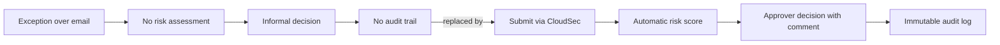
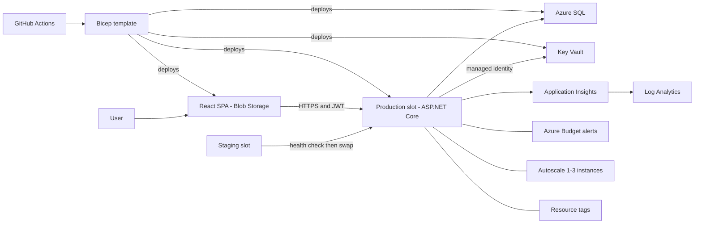
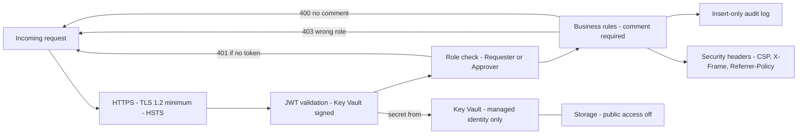
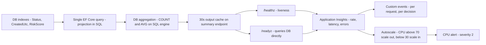
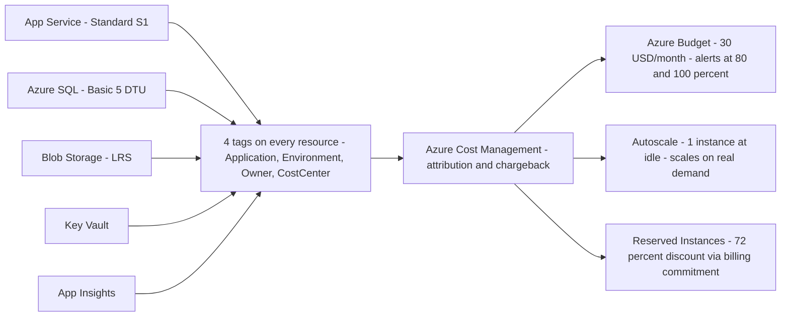

# CloudSec — Demo Diagrams

Show each diagram at the segment indicated. Hold on screen for 30–60 seconds while narrating.

---

## 1. Business problem — before vs after

> Use in **Segment 1** (0:00–2:00)

---

## 2. System architecture

> Use in **Segment 2** (2:00–6:00)

---

## 3. Security controls

> Use in **Segment 3** (6:00–10:00)

---

## 4. Performance and monitoring

> Use in **Segment 5** (14:00–16:30)

---

## 5. Cost governance

> Use in **Segment 6** (16:30–18:30)

---

## Segment placement

| Diagram | Segment | When to show |
|---|---|---|
| Business problem | 1 | Opening — frame the problem |
| System architecture | 2 | Walk through deployed services |
| Security controls | 3 | Before the 401/403/400 live demo |
| Performance and monitoring | 5 | While discussing autoscale rules |
| Cost governance | 6 | While showing tags and budget |
