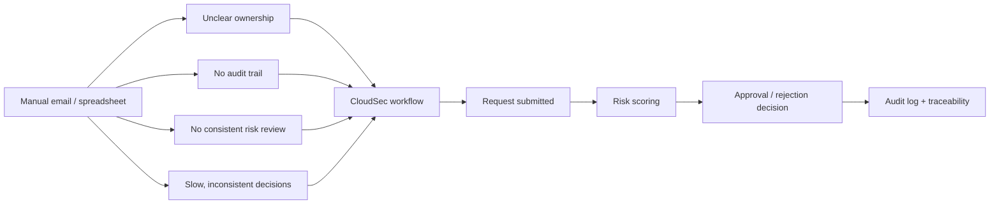
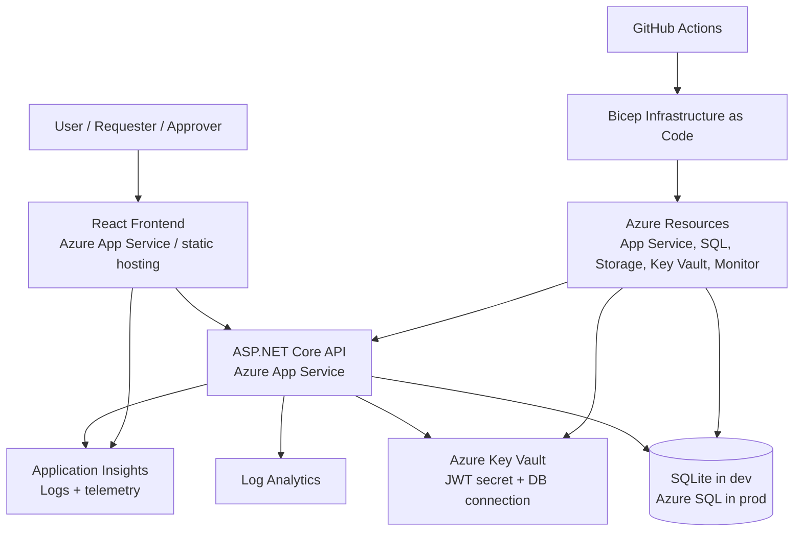
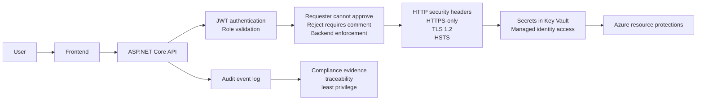
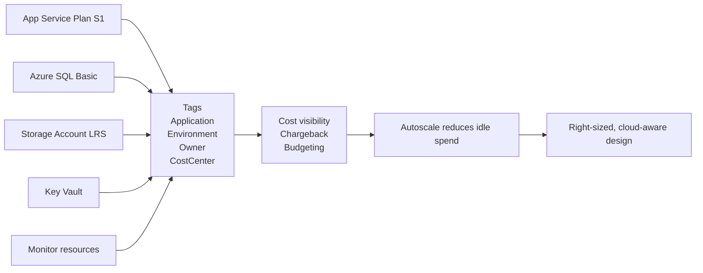

# CloudSec — Slide Plan

10 slides, 20 minutes. Each slide maps to one or more rubric criteria.

---

| # | Title | Rubric criterion | Duration | Key message |
|---|-------|-----------------|----------|-------------|
| 1 | CloudSec | All | 0:00–1:00 | Introduce the app and assessment context |
| 2 | Business problem | Knowledge & understanding (15%) | 1:00–3:00 | Why manual exception handling is a governance risk |
| 3 | Solution overview | Knowledge & understanding (15%) | 3:00–5:00 | Requester/approver workflow and audit trail |
| 4 | Architecture | Design and architecture (35%) | 5:00–8:00 | Service choices, IaC, Key Vault, managed identity |
| 5 | Security and compliance | Security and compliance (10%) | 8:00–11:00 | JWT, RBAC, headers, GDPR mapping, PCI alignment |
| 6 | Live demo | Deployment artefact (all) | 11:00–14:30 | Working end-to-end flow with evidence |
| 7 | Performance and monitoring | Performance optimisation (20%) | 14:30–16:30 | Health endpoints, App Insights, autoscale rules |
| 8 | Cost management | Cost management (20%) | 16:30–18:30 | Tags, right-sizing, autoscale, cost governance |
| 9 | Risks and future work | Design and architecture (35%) | 18:30–19:30 | Trade-offs, roadmap, Entra ID, multi-region |
| 10 | Conclusion | All | 19:30–20:00 | Summary mapped to assessment criteria |

---

## Slide content notes

### Slide 1 — Title
- App name and subtitle: "Secure exception management for internal governance"
- Evidence: screenshot of the running frontend

### Slide 2 — Business problem
- Problem: uncontrolled exceptions, no audit trail, inconsistent decisions
- Context: professional services / legal firm handling confidential data
- Evidence: process diagram showing before/after

### Slide 3 — Solution overview
- Roles: Requester, Approver
- Workflow: Submit → Risk score → Approve/Reject → Audit event
- Evidence: request form screenshot, request list screenshot, event timeline

### Slide 4 — Architecture
- Diagram: React → API → SQL with Azure services around it
- Services: App Service, Azure SQL, Storage, App Insights, Log Analytics, Key Vault
- Highlight: IaC with Bicep, CI/CD with GitHub Actions, managed identity for secret access
- Evidence: architecture diagram, resource group screenshot, Bicep template excerpt

### Slide 5 — Security and compliance
- JWT auth with role-based enforcement
- HTTP security headers
- Key Vault references (no plaintext secrets)
- HTTPS-only, TLS 1.2, FTPS-only
- GDPR: minimisation, accountability, auditability
- Evidence: API auth screenshot, headers in browser dev tools, Key Vault screenshot, App Service config

### Slide 6 — Live demo
- Show full flow: login → submit → approve/reject → dashboard
- Highlight backend enforcement: rejection without comment returns 400
- Highlight role enforcement: requester attempting decision returns 403
- Evidence: screen recording of working app

### Slide 7 — Performance and monitoring
- /healthz and /readyz endpoints
- App Service health check path set to /healthz
- Application Insights request/failure/latency charts
- Autoscale: scale out at >70% CPU, scale in at <30% CPU, max 3 instances
- CPU alert at severity 2
- Evidence: App Insights dashboard, autoscale rules screenshot, health endpoint response

### Slide 8 — Cost management
- S1 App Service Plan (minimum for autoscale support)
- Basic Azure SQL (appropriate for workload)
- Standard LRS storage (low-cost, sufficient for static site)
- Resource tags: Application, Environment, Owner, CostCenter
- Autoscale as cost control (scale to 1 at idle)
- Evidence: resource tags screenshot, pricing rationale table, autoscale screenshot

### Slide 9 — Risks and future improvements
- Current: application-issued JWT — next: Entra ID SSO
- Current: single region — next: geo-redundant SQL + multi-region failover
- Current: Key Vault in place — next: secret rotation schedule
- Current: no formal retention policy — next: archival workflow for resolved requests
- Evidence: brief risk/roadmap table

### Slide 10 — Conclusion
- One line per rubric criterion confirming what was delivered
- Final screenshot of deployed app

---

## Diagram placement and explanation

Use the following diagrams in the deck. Each is intentionally simple and can be drawn as Mermaid markdown in the presentation notes or exported to a slide as a diagram. The diagrams below are also stored in `docs/presentation-diagrams.md`.

### Diagram 1 — Business problem / before vs after

Use on: Slide 2



Why it matters:
- Shows the current pain clearly
- Frames the app as a governance improvement, not just a feature list
- Explains the problem in a way a non-technical audience understands

### Diagram 2 — Core architecture

Use on: Slide 4



Why it matters:
- Demonstrates a realistic cloud architecture
- Proves the system is designed as a three-tier application with production-minded monitoring and secrets management
- Supports the architecture rubric by showing the service choices and Azure context

### Diagram 3 — Security control flow

Use on: Slide 5



Why it matters:
- Shows that security is enforced in the backend rather than only in the UI
- Directly supports the security and compliance narrative
- Demonstrates least privilege, auditable decisions, and operational controls

### Diagram 4 — Monitoring and health / autoscale

Use on: Slide 7

```mermaid
flowchart TB
    LB[Azure App Service / Health Probe] --> HZ[/healthz]
    LB --> RD[/readyz]
    HZ --> API[API service]
    RD --> API

    API --> AI[Application Insights]
    AI --> METRICS[Request rate\nLatency\nFailures]

    API --> SCALE[Autoscale rules]
    SCALE --> CPU[CPU > 70% for 5 min\nScale out]
    CPU --> APP[More instances]
    SCALE --> LOW[CPU < 30% for 10 min\nScale in]

    API --> ALERT[CPU alert severity 2]
```

Why it matters:
- Shows the application has health checks and operation-aware design
- Demonstrates observability and production readiness
- Supports the performance and optimisation theme with evidence beyond a single demo

### Diagram 5 — Cost management and governance

Use on: Slide 8



Why it matters:
- Demonstrates that cost is part of the design, not an afterthought
- Shows the importance of tags and resource accountability
- Helps connect technical choices to governance and responsible cloud operations

## Evidence capture checklist

Capture these before recording:

- [ ] Screenshot: frontend dashboard (logged in, requests visible)
- [ ] Screenshot: request form with data classification drop-down
- [ ] Screenshot: request list showing different statuses
- [ ] Screenshot: audit event timeline on a completed request
- [ ] Screenshot: rejection validation (comment required)
- [ ] Screenshot: approver forbidden from self-creating decision (403)
- [ ] Screenshot: Azure resource group with all resources
- [ ] Screenshot: App Service configuration (HTTPS only, health check path)
- [ ] Screenshot: Key Vault and secret references in app settings
- [ ] Screenshot: App Insights — requests, failures, latency
- [ ] Screenshot: Autoscale settings
- [ ] Screenshot: CPU metric alert
- [ ] Screenshot: Resource tags on one or more resources
- [ ] Screenshot: GitHub Actions successful run with summary output
- [ ] Screenshot: Frontend URL live in browser
- [ ] Screenshot: /healthz and /readyz JSON responses
